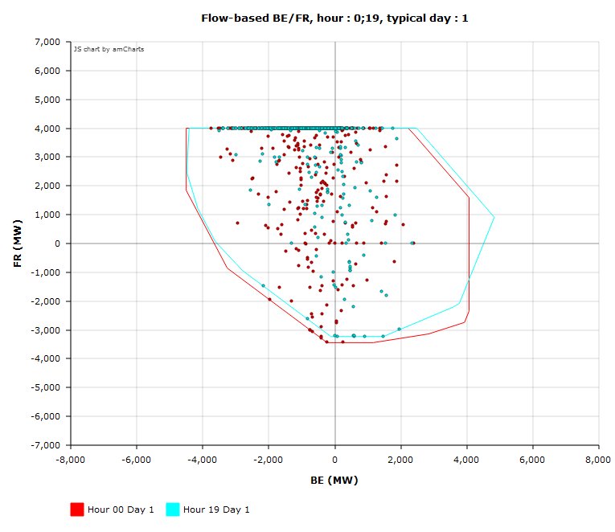
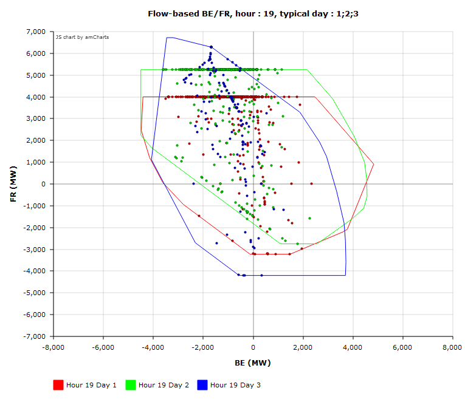
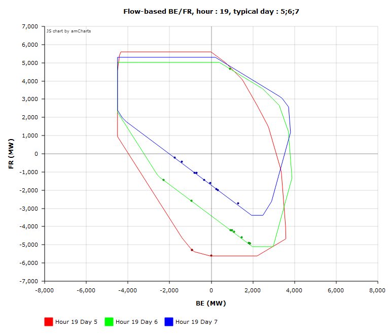
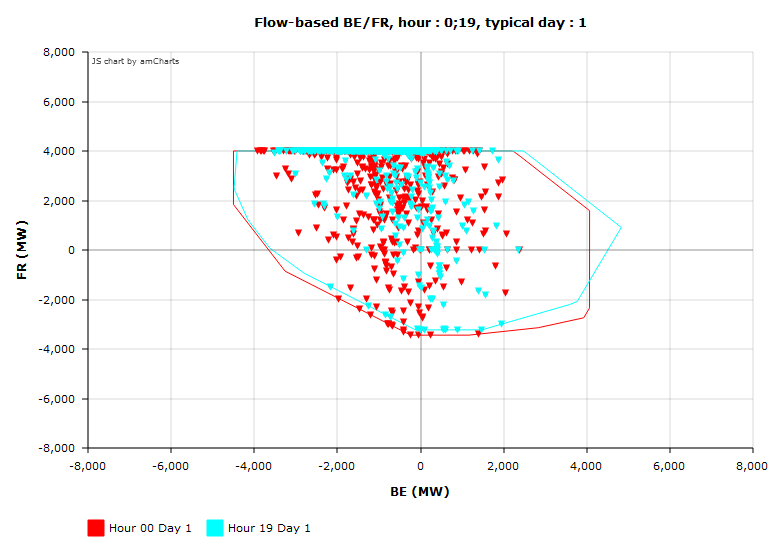
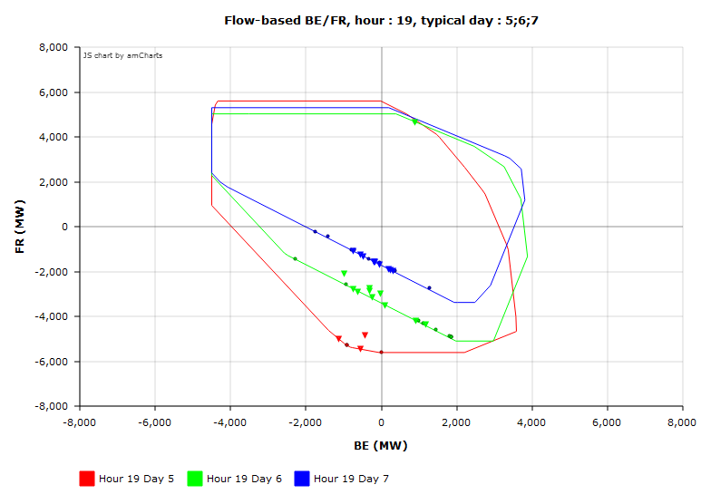
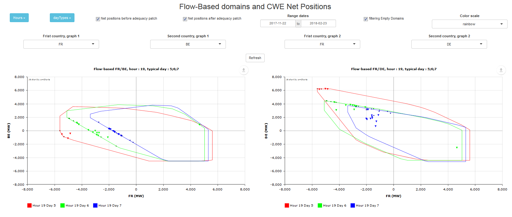

```{r setup, include=FALSE}
knitr::opts_chunk$set(echo = TRUE)
```

## Visualisation of antares simulation with plotNetPositionFB

Load you data before graph

```{r, eval=FALSE}
 study <- "MyStuDy"

 opts <- antaresRead::setSimulationPath(study, 2)
 dta <- antaresRead::readAntares(areas = c("fr", "be", "de", "nl"),
                                 links = c("be - de","be - fr","be - nl",
                                 "de - fr","de - nl"), mcYears = 1:10,
                                 select = c("LOLD", "UNSP. ENRG",
                                 "DTG MRG", "UNSP. ENRG", "BALANCE", "FLOW LIN."),
                                  opts = opts)
```
 
```{r, eval=FALSE}

 ## plot a domain and the matching output points
 plotNetPositionFB(fb_opts = opts,
          data = dta,
          dayType = 1, hour = c(0, 19),
          country1 = "BE", country2 = "FR")
```




```{r, eval=FALSE}
 ## plot domains
 plotNetPositionFB(fb_opts = opts,
          data = dta,
          dayType = c(1,2,3), hour = c(19),
          country1 = "BE", country2 = "FR")
```




#####When you select somes raws, you must select all areas for a given timestep
```{r, eval=FALSE}
 ##An exemple of authorized filter :
 idC <- c(antaresRead::getIdCols(dta$areas))
 idC <- idC[idC!="area"]
 LOLD <- dta$areas[,lapply(.SD, sum), by = idC, .SDcols = "LOLD"]
 LOLD <- LOLD[LOLD!=0]
 LOLD[,LOLD := NULL]
 #Here merge is used for filter data
 dta$areas <- merge(dta$areas, LOLD, by =  idC)
 ##End filter

```


#####Use dayType = "all" and filteringEmptyDomains = TRUE
```{r, eval=FALSE}
 ## plot domains
 plotNetPositionFB(fb_opts = opts,
          data = dta,
          dayType = "all", hour = c(19),
          country1 = "BE", country2 = "FR", filteringEmptyDomains = TRUE)
```



#adqPatch
```{r, eval=FALSE}

 study <- "MyStuDy"
 opts <- antaresRead::setSimulationPath(study, 2)
 dta <- adqPatch()
```

You can use strategic_reserve_de and strategic_reserve_be to add strategic margin. 


#####Visualisation of adqPatch points
```{r, eval=FALSE}

 ## plot a domain and the matching output points
 plotNetPositionFB(fb_opts = opts,
          data = dta,
          dayType = 1, hour = c(0, 19),
          country1 = "BE", country2 = "FR")
```




#####Visualisation of adqPatch points only on timesteps concerned by adqPatch, points are values before adqPatch and triangle are values after adqPatch.
```{r, eval=FALSE}
 ##An exemple of authorized filter :
 idC <- c(antaresRead::getIdCols(dta$areas))
 idC <- idC[idC!="area"]
 LOLD <- dta$areas[,lapply(.SD, sum), by = idC, .SDcols = "LOLD"]
 LOLD <- LOLD[LOLD!=0]
 LOLD[,LOLD := NULL]
 #Here merge is used for filter data
 dta$areas <- merge(dta$areas, LOLD, by =  idC)
 ##End filter
 ## plot a domain and the matching output points
 plotNetPositionFB(fb_opts = opts,
          data = dta,
          dayType = c(5,6,7), hour = c(19),
          country1 = "BE", country2 = "FR")
```




#runAppPosition

#####All arguments of plotNetPositionFB function are included in a shiny app
```{r, eval=FALSE}
runAppPosition(dta)
```



#Post treatments

##addNetPosition
```{r, eval=FALSE}
opts <- antaresRead::setSimulationPath("MyStuDy", 2)
data <- readAntares(area = "all", links = "all", mcYears = 1)

##Add net position for CWE
data <- addNetPosition(data, opts, adq = FALSE)

##Add net position for CWE+AT
data <- addNetPosition(data, opts, adq = FALSE,
 inAreas = c("be", "de", "fr", "nl", "at"), newName = "_CWEAt")
```


##addTypicalDayId
```{r, eval=FALSE}

 antaresRead::setSimulationPath("MyStuDy", 1)
 data <- readAntares(areas = "all", links = "all", clusters = "all" ,mcYears = 1:10)
 data <- addTypicalDayId(data)
```


#adqPatch in h5 file : adqH5
```{r, eval=FALSE}
##Opts defind on txt files
opts <- antaresRead::setSimulationPath("MyStuDy",2)

##Write h5 study
antaresRead::writeAntaresH5()

##Do a setSimulationPath on h5 file
opts <- antaresRead::setSimulationPath("MyNewStudy",1)

##Use for user folder, you cal also use setFlowbasedPath
fb_opts = antaresRead::setSimulationPath("MyOldStudy", 2)

##Compute adq on H5 file
adqH5(opts, fb_opts)

##Set alias for an easy read
setAlias("adqPatch", "Alias for adqPatch", c("LOLD_ADQPatch",
                                             "UNSP. ENRG_ADQPatch", "DTG MRG_ADQPatch",
                                             "UNSP. ENRG_ADQPatch", "BALANCE_ADQPatch",
                                             "FLOW LIN._ADQPatch",
                                             "areas", "links"))

##Read with alias
readAntares(select = "adqPatch", opts = opts, mcYears = 1)

##Plot/apps works like no-h5
```
