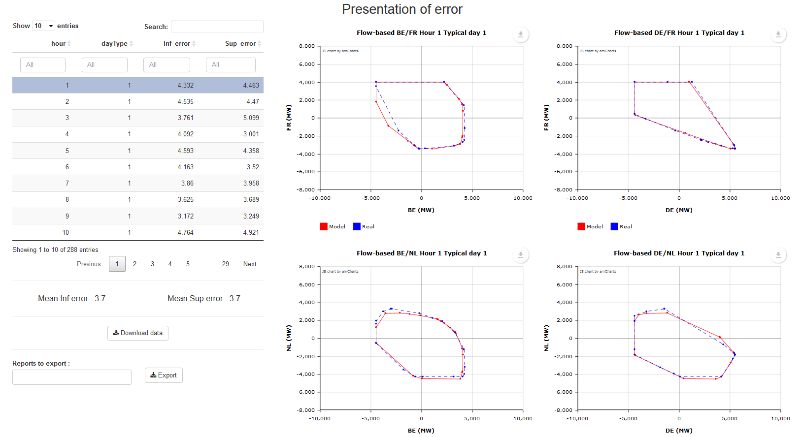
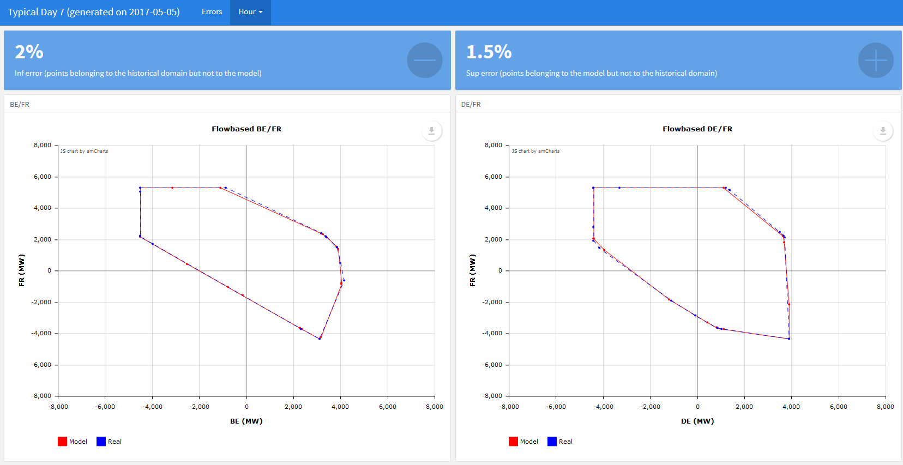

```{r setup, include=FALSE}
knitr::opts_chunk$set(echo = TRUE)
```

``antaresFlowbased`` allows to model **flow-based** domains into adequacy studies using the software *Antares*, with 3 main parts : 

- Projection of flow-based domains on a fix basis, so as to be able to describe them in Antares with binding constraints.
- Construction of probabilistic flow-based time series, respecting the correlations with other inputs of the study (e.g. load, wind power generation, solar generation).
- Simulation of an Antares study where CWE exchanges are bounded by flow-based domains.


## 1 - Summary

```{r, eval=FALSE}

#Convert domains from PTDF file, save the output in the directory "model1"
computeFB(PTDF = system.file("/input/ptdf/PTDF.csv", package = "antaresFlowbased"),
          outputName = "D:/Users/titorobe/Desktop/model1", verbose = 0, nbFaces = 36)

#Add time series file to directory "model1"
addTSFile("D:/Users/titorobe/Desktop/model1")

#Set setFlowbased directory path
setFlowbasedPath(path = "D:/Users/titorobe/Desktop/model1")

#Run shiny application to visualize the results of the convertion
runAppError()

#Set antares study path
antaresRead::setSimulationPath("D:/exemple_test", 0)

#Initialize the Antares study
initFlowBased()

#Set Antares solver path
setSolverAntares(path = "C:/Program Files/RTE/Antares/5.0.9/bin/antares-5.0-solver.exe")

#Run Antares simulation
runSimulationFB()
```

## 2 - Projection of domains

The function ``computeFB()`` converts flow-based domains (e.g. historical flow-based domains of some "typical representative days") into an Antares model with fixed PTDF. It uses the main following parameters : 

* ``PTDF`` : PTDF file path
* ``outputName`` : name of output directory
* ``reports`` : Boolean indicating whether the function generates html reports or not

``PTDF`` is a csv file with **;** field separator, **,** for decimal points and the following columns :

* **Id_day** : Id of typical day (integer)
* **Period** : Hour (integer)
* **BE** : PTDF for be 
* **DE** : PTDF for de
* **FR** : PTDF for fr
* **NL** : PTDF for nl
* **RAM** : margin

By default, ``PTDF`` argument takes the value **Adequacy2017**. In that case, the typical days used are coming from internal data stored in the package.

One can also set the following optionnal arguments of the function :

* ``dayType`` : subset of typical days to process
* ``hour`` : subset of hours to process
* ``nbFaces`` : number of binding constraints in the final Antares model (by default : 36).

The function creates a directory with the following files :

* **weight.txt** : PTDF for the antares model (weight of the binding constraints - constant over time)
* **second_member.txt** : RAM for the antares model (second member of the binding constraints - variable over the typical days and hours)
* **domainesFB.RDS** : Information about the modeled domains (points, errors , accuracy of the model,...)
* **reports** : a directory, created only if ``reports == TRUE`` with a html report for each typical day.

To add flow-based time series file to this folder, the function ``addTSFile()`` must be used. In this version of the package, the time series file can't be changed, they are the ones generated for adequacy studies in 2017. The ``outputName`` specifies the directory where the time series files will be saved. We recommend to specify the same folder as the one given to ``computeFB()``.


## 3 - Data initialization

Once the modeled flow-based domains have been created with ``computeFB()``, they can be loaded using the following function :

* ``setFlowbasedPath()`` : set the model directory (directory in which the output of ``computeFB()`` have been saved)

```{r, eval = FALSE}
# Specify a repository
setFlowbasedPath(path = "C:/PATH/TO/INPUT")
```

Moreover, ``the antaresFlowbased`` package contains some already built domains, notably the ones used in the last model. The data contained in the package can be seen with the function ``getAvailableModel()``. Thus, instead of loading an external directory with ``setFlowbasedPath()``, the internal data of the package can be used.


```{r, echo = FALSE}
suppressWarnings(require(antaresFlowbased, quietly = T))

```

```{r}
require(antaresFlowbased)

# available in package
getAvailableModel()

# Specify a model already available in the package
setFlowbasedPath(model = "model2017")

```

The directory must contain :

* **weight.txt** : PTDF for the antares model (weight of the binding constraints - constant over time)
* **second_member.txt** : RAM for the antares model (second member of the binding constraints - variable over the typical days and hours)
* **domainesFB.RDS** : Information about domains (points, errors ,...)
* **ts.txt** : flow-based time series


## 4 - Visualization & reports

One can visualize the modeled flow-based domains, download the associated data or create a summary of the model accuracy in a html document using a **shiny** application with the function ``runAppError()``.

<div style="text-align:center" markdown="1">

</div>


``plotFB()`` can also be used to plot one or more domains directly in R : 

```{r, fig.width= 7, fig.height= 7, warning=FALSE}
# one graphic
plotFB(hour = 5, dayType = 1, country1 = "FR", country2 = "DE")

# multiple countries and hour
plotFB(hour = 5:6, dayType = 1, country1 = c("FR", "DE"), country2 = c("DE", "NL"))

```

Reports in html format can also be generated within the shiny application. This solution can be use to facilitate the transmission and communication of the results.
<div style="text-align:center" markdown="1">

</div>


## 5 - Study initialization

First of all, it is necessary to indicate an antares study using ``setSimulationPath()`` function of the package ``antaresRead``.

Then, the flow-based model which will be set on this study must be specified with ``setFlowbasedPath()``. 

The initialization of the study is finally done with the function ``initFlowBased()``. 


``initFlowBased()`` write the following 4 files in the folder */user/flowbased* of the study :

* second_member.txt
* weight.txt
* scenario.txt
* ts.txt

Moreover, ``initFlowbased()`` creates new binding constraints in the Antares study.

```{r, eval=FALSE}
antaresRead::setSimulationPath("D:/exemple_test", 0)

# initialisation of flow-based study
initFlowBased()
```


## 6 - Run simulations

You must run simulations directly with antares.